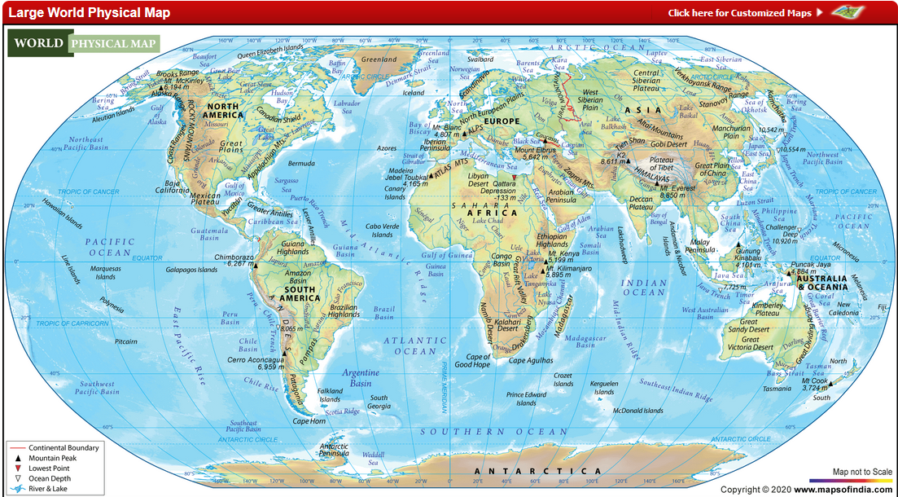
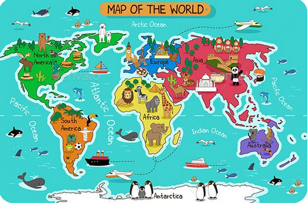
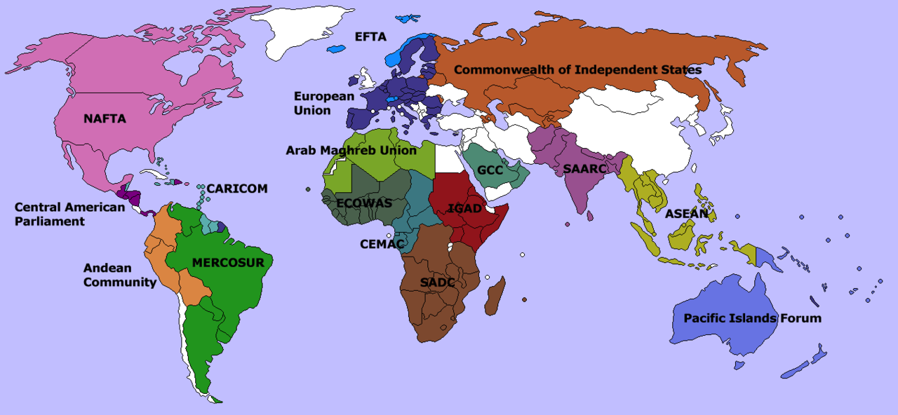
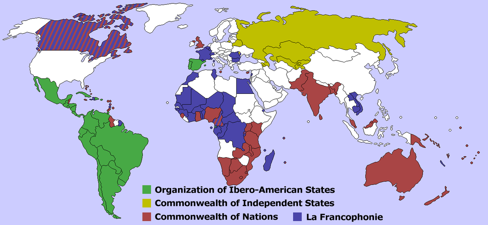
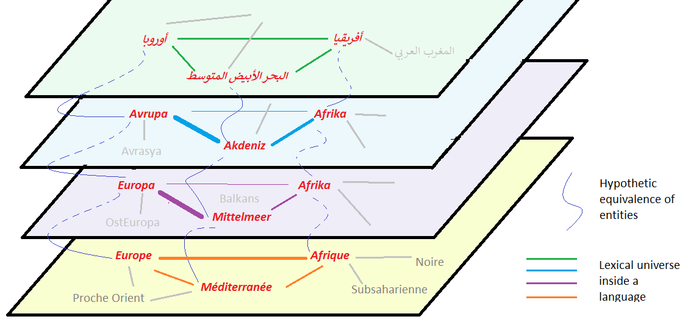

```{r setup, include=FALSE}
knitr::opts_chunk$set(echo = FALSE)
library(knitr)
```

## INTRODUCTION

## Looking for regions

The objective of this short note is to explore the possibility of **Wikidata** for the production of multilingual dictionaries of world regions and more generally regional imaginations. In order to test the interest of this approach, we will try to produce multilingual dictionaries for the identification of different types of "regions" related to the division of the **Earth** ("natural") or the division of the **World** ("political")

- **"Earth/Natural regions"** : i.e. regions that are used in Atlas of Dictionaries for the localization at the surface on the earth and/or taught to young students in textbook as primary or secondary divisions of the surface of the Earth.

- **"World/Political regions"** : i.e. groups of states that are linked by formal  international organization (e.g. European Union, ASEAN, ...) and/or are perceived as linked politically or economically by themselves of in the eye of external observers (e.g. BRICS, Eurasia)

## Earth/Natural regions: Atlas

So-called "Physical maps" in Atlas are a good source :

```{r,out.width="70%"}

```

- **continents** : Asia, Africa, Europa, ...
- **subcontinents** : North Africa, Western Europe,..
- **peninsula/ archipel/ ...** : Scandinavia, Caraïbes, ...
- **bioclimatic area** : Sahara, Amazonia, Sahel
- **mountains/plain/...** : Alps, Balkans, Ands, ...
- **Oceans/Seas/Gulf** : Atlantic, Arctic, Mediterranea


## Earth/natural regions : Textbooks

Textbooks and educative games for children are also crucial : 

```{r,out.width="45%"}

knitr::include_graphics("pics/Cont_school3.png")
knitr::include_graphics("pics/Cont_school4.png")
knitr::include_graphics("pics/Cont_school5.png")
```


## World/Political regions : IGO

```{r,out.width="45%"}
knitr::include_graphics("pics/Orgs_Map_1.png")

knitr::include_graphics("pics/Orgs_Map_3.png")

```

An attempt to classify intergovernmental organization in 4 types :

1. Continental organizations
2. Subcontinental organizations
3. Transcontinental alliances
4. Heritage of empires

Source : https://commons.wikimedia.org/wiki/Atlas_of_international_organizations

## World/Political regions : Other ...

```{r,out.width="45%"}
knitr::include_graphics("pics/Huntington_1.png")
knitr::include_graphics("pics/Huntington_2.png")
knitr::include_graphics("pics/eurasia-map.jpg")
knitr::include_graphics("pics/UPM carte.jpg")
```


## A cross-language perspective

We propose to etablish a dictionary of Earth and World Regions in the five languages of interest for the project IMAGEUN :

-   **english** : applied to media of UK and Ireland
-   **french** : applied to media of France and Tunisia
-   **german** : applied to media of Germany
-   **turkish** : applied to media of Turkey
-   **arabic** : applied to media of Tunisia

We want to avoid any *"eurocentric"* or *"anglocentric"* perspective in the definition of entities. Therefore our definition of entities will follow the following rules :

1. **Non universal** : Entities will not necessary be available in all languages
2. **Non equivalent** :  Translation of names does not imply equivalence of entities
3. **Non hierarchic** : An entity has different definitions in each language. None of the language can be considered as "pivot" or "reference". 

## Entities equivalences and lexical universes

To summarize, we propose to build **partial equivalences** between entities that belong to **different lexical universes**.

```{r,out.width="85%"}


```

The comparison between lexical universes will be necessarily limited to a small sample of entities for which we can assume that the entities are approximately equivalent.  


## WIKIDATA 

## What is Wikidata ?

[Wikidata](https://www.wikidata.org/wiki/Wikidata:Main_Page) defines itself as

-   a free and open knowledge base that can be read and edited by both humans and machines.
-   as central storage for the structured data of its Wikimedia sister projects including Wikipedia, Wikivoyage, Wiktionary, Wikisource, and others.
-   a support to many other sites and services beyond just Wikimedia projects.
-   The content of Wikidata is available under a free license, exported using standard formats, and can be interlinked to other open data sets on the linked data web.

## Codification of entities

The first interest of wikidata is to provide unique code of identifications of objects. For example a research about "Africa" will produce a list of different objects characterized by a unique code :

```{r}
knitr::include_graphics("pics/Wikidata001.png")
```

## Informations on entities

Once we have selected an entity (e.g. **Q15**) we obtain a new page with more detailed informations in english but also in all other languages available in Wikipedia.

```{r}
knitr::include_graphics("pics/Wikidata002.png")
```

## Informations on entities

A lot of information are available concerning the entity but, at this stage, the most important ones for our research are :

1.  the **translation** in different languages
2.  the **equivalent** words or expression in different languages
3.  the **definitions** in different languages
4.  the **ambiguity** of the term in each language and the potential risks of confusion with other entities.

Of course we should not take for granted the answers proposed by wikidata (as noticed by Georg, Wikipedia is a matter of research for IMAGEUN ...) but without any doubt, it offers a very good opportunity to clarify our questions and help us to build tools for recognition of world regions and other geographical imaginations in a multilingual perspective.

## Multilanguage defintions 

A **wikipedia entity** like *Q15* is an **element of an ontology** designed by its author for specific purposes. The specificity of the wikidata ontology is the fact that it is a **multilinligual web** where Q15 is a **node of the web** present in different linguistic layers. It means that we don't have a single name or a single definition of Q15, except if we adopt the neocolonial perspective to choose the english language as reference. Depending on the context (i.e. the language or sub-language), Q15 could be defined as :

```{r}
X1 <-c("fr",  "A *continent* named *Afrique*")

X2 <- c("en", "A *continent on the Earth's northern and southern hemispheres* named *Africa* or *African continent*")

X3 <- c("de", 'A *"Kontinent auf der Nord- und Südhalbkugel der Erde"* named *"Afrika"*')
X4 <- c("tr",  'A *"Dünya nın kuzey ve güney yarıkürelerindeki bir kıta"* named *"Afrika"* or *"Afrika kıtası"*')
X5 <- c("ar", 'The second largest continent in the world in terms of area and population, comes second only to Asia (trad.)')
  
 z<-data.frame(rbind(X1,X2,X3,X4, X5))
 names(z)<- c("language", "definition")
kable(z,row.names = F)
 
```


## Correspondance between entities ?

The **existence of the same code of wikipedia entities does not offer any guarantee of concordance between the geographical objects found in news published in different languages or different countries**. But - and it is the important point - it help us to point similarities and differences between set of geographical entities that are more or less comparable in each language.

-   **Ex. 1 Amazonie** : In french language, *Amazonie* is associated to the entity **Q2841453** which is defined as a *"région naturelle en Amérique du Sud"*. But this entity does not exist apparently in turkish language. At the same time the french language propose also an entity "*Forêt amazonienne*" **Q177567** defined as *forêt équatoriale située dans le bassin amazonien en Amérique du Sud* which is present in tukish language. We have also a third entity *bassin amazonien* identified as **Q244451** which refers to so-called *régions naturelles* based on water basin [@cholley1939]

- **Ex.2 Proche-Orient/Moyen-Orient/Pays du Golfe/ Asie de l'Ouest** : In french language we find four entities describing the complex geopolitical area located in western part of Asia and eastern part of Mediterranea. But this entities are not necessary used in all languages with the same frequency and can be completed by other entities like western Asia. The entity  *Proche-Orient* (**Q48214**) which is frequent in french is only available in 30 languages when the *Moyen-Orient* (**Q7204**) is available in 84 languages,  *golfe Persique* (**Q34675**) in 77 languages and *Asie de l'Ouest* (**Q27293**) in 71 languages. 

## Cross-language perspective

Having in mind the limits of the equivalence of entities across languages, it can nevertheless be an interesting experience to select a set of wikipedia entities (**Q15, Q258, Q4412** ...) and to examine their relative frequency in our different media from different countries with different languages. A typical hypothesis could be something like :

- Is **Q15** more mentionned than **Q46** in Tunisian newspapers ?

which is *not equivalent* to the question 

- Is **Africa** more mentionned than **Europe** in Tunisian newspapers

but rather equivalent to the two joint questions

- Is the textual unit **"Afrique"** more mentionned than the textual unit **"Europe"** in Tunisian newspapers published **in french language**.
- Is the textual unit **"إفريقيا"** more mentionned than the textual unit **"أوروبا"** in Tunisian newspapers published **in arabic language**.

## EXPERIMENT

We propose a **semi-automatic** method of extractions of entities in different languages that implies the presence of **human expert** at each step of the analysis. The figure below describe an example of research of world regions related to Africa in three languages. 


```{r, out.width="95%"}
knitr::include_graphics("pics/Wikidata.png")
```


## The package WikidataR

The package [WikidataR](https://cran.r-project.org/web/packages/WikidataR/WikidataR.pdf) is an interface for the use of the Wikidata API in R language. Equivalent tools are available in Python and other languages for those non familiar with R. And it is of course possible to use directly the API. The first step is to install the most recent version of the R package `WikidataR` which install also related packages of interest.

```{r, echo=TRUE, warning = FALSE}
#install.packages("WikidataR")
library(WikidataR)
```


## Extraction of entities

If we start our research with the **word**  "*Afrique*" in french language we find more than 50 **entities** that contain this word in their **label**. Only the first 10 are presented below : 

```{r}
mytext <- "Afrique"

items <- find_item(search_term = mytext,
                   language = "fr",
                   limit=30)

item_info <- function(my_item){ 
  

    if (is.null(my_item$id) == F){item_id = my_item$id}
        else {item_id  = NA}
  
    if (is.null(my_item$label) ==F){item_label = my_item$label}
        else {item_label  = NA}
  
    if (is.null(my_item$desc) == F) {item_desc= my_item$desc}
        else {item_desc  = NA}
  
    if (is.null(my_item$match$lang) ==F){item_lang = my_item$match$lang}
        else {item_lang  = NA}
  
    if (is.null(my_item$match$text) ==F){item_text = my_item$match$text}
        else {item_text  = NA}

  
  res<-data.frame(item_id,item_label,item_desc,item_lang,item_text)
  
  return(res) 
  }


extract_entities <- function(mytext= "Afrique",
                             mylang = "fr",
                             maxres = 20) {
  # Extract items
  items <- find_item(search_term =  mytext,
                   language      =  mylang,
                   limit         =  maxres)
  
  # Create empty dataset
  res<-data.frame()
  res$item_id    <- as.character()
  res$item_label <- as.character()
  res$item_desc <- as.character()
  res$item_lang  <- as.character()
  res$item_text  <- as.character()
  
  # Fill dataset
  k<-length(items)
      for (i in 1:k) {
           res <- rbind(res,item_info(items[[i]]))
      }
  
  # Return dataset
  return(res)

}

tab <- extract_entities("Afrique","fr",10)
kable(tab)
```

## Selection of entities

The analysis of the list of result reveals four situations :


1. **Target entities**:  A first list is related to entities that can be considered as world regions or geographical imaginations of interest for IMAGEUN. It is typically the case for the whole continent of Afrique (**Q15**) and its different subdivisions like North Africa (**Q27381**), West Africa (**Q4412**), Sub-Saharan Africa (**Q132959**).

2. **Control entities** : A list of entities that are not regions but should be controled if we want to identify our target entities. A typical example is the sovereign state of South Africa (**Q258**) which will necessary introduce mistakes in the identification of Africa as a continent if it is not controled. The problem will not necessary exist in all languages (e.g. German) but is important.

3. **Ambiguous entities** : Some entities are ambiguous because they are not regions but use exactly the same textual units than a target entity. It is for example the case of the roman province of Africa (**Q181238**) which can not be easily differentiated from the continent, except by manual inspection. This units are not easy to control but fortunately are generally not frequent.

4. **Insignificant entities** : Those entities that are exceptional inthe corpus can be simply gnored. 


## Bibliography